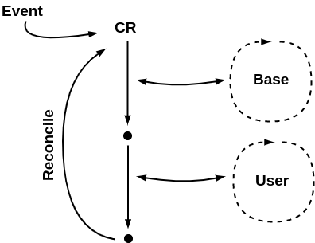
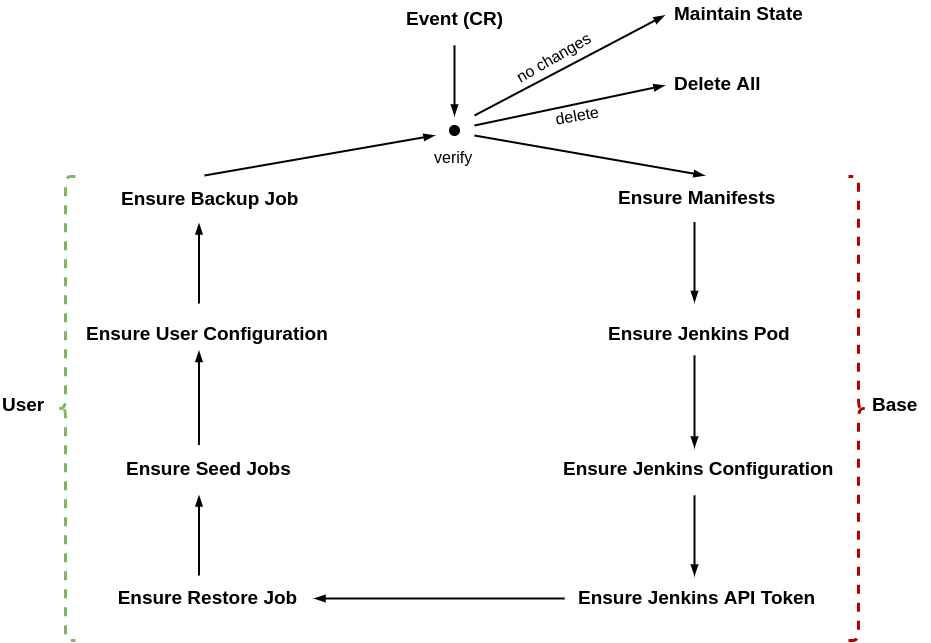

# How it works

This document describes a high level overview how jenkins-operator works. 

## Architecture and design

The Jenkins operator design incorporates the following concepts:
- watches any changes of manifests and maintain desired state according to deployed custom resource manifest
- implements a main reconciliation loop which consists of two smaller reconciliation loops - base and user 

Base reconciliation loop takes care of reconciling base Jenkins configuration, which consists of:
- Ensure Manifests - monitors any changes in manifests 
- Ensure Jenkins Pod - creates and verifies status of Jenkins master Pod
- Ensure Jenkins Configuration - configures Jenkins instance including hardening, initial configuration for plugins, etc.
- Ensure Jenkins API token - generates Jenkins API token and initialized Jenkins client

User reconciliation loop takes care of reconciling user provided configuration, which consists of:
- Ensure Restore Job - creates Restore job and ensures that restore has been successfully performed  
- Ensure Seed Jobs - creates Seed Jobs and ensures that all of them have been successfully executed
- Ensure User Configuration - executed user provided configuration, like groovy scripts, configuration as code or plugins
- Ensure Backup Job -  creates Backup job and ensures that backup has been successfully performed

## Operator State

Operator state is kept in custom resource status section, which is used for storing any configuration events or job statuses managed by the operator.
It helps to maintain or recover desired state even after operator or Jenkins restarts.

## System Jenkins Jobs

The operator or Jenkins instance can be restarted at any time and any operation should not block the reconciliation loop so we implemented
custom jobs API for executing and verifying status of them according to operator lifecycle.

Main assumptions are:
- do not block reconciliation loop
- fire job, requeue reconciliation loop and verify status next time
- handle retries if case of failure
- handle build expiration (deadline)
- keep state in the custom resource status